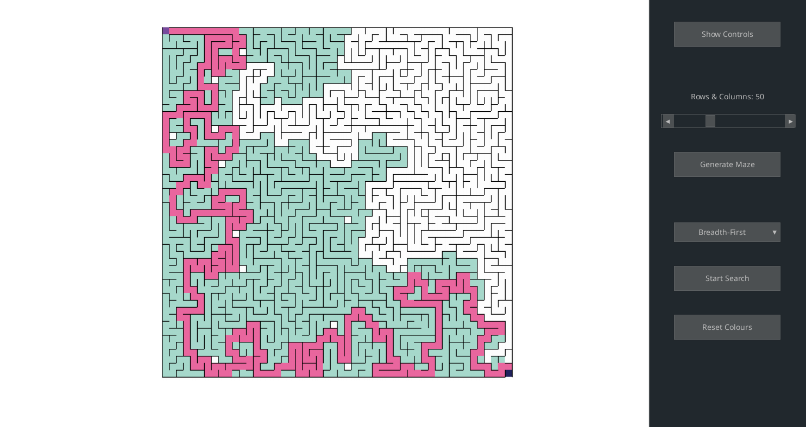

# Maze Generator, Visualiser & Solver
This program is a maze **generator**, **visualiser**, and **solver** that uses various different algorithms. The purpose of this program is to increase my familiarity with **data structures and algorithms** specifically with graphs.

This program is made in both **C** and **Python**. The generator and solver is made with C, whilst the visualiser is made in Python using Pygame as the graphics library. These 2 languages are connected by using the **ctypes** library in Python.

Currently the maze generator uses **backtracking** to create the maze and the maze-solver uses **Breadth-First Search**. In the future i am looking to expand the number of algorithms for both generation and searching.

## Table of Contents
-[Preview](#preview)
-[Platforms](#platforms)
-[Installation](#installation)
    -[Get Source Code](#get-source-code)
    -[Dependencies](#dependencies)
        -[Windows](#windows)
        -[Linux](#linux)
    -[Compilation](#compilation)

## Preview


## Platforms
You should be able to compile the program successfully on the following platforms:
* Windows 10/11 (MinGW)
* Linux (Most distros)

## Installation
### Get Source Code
Clone the repository using the following command:
```git
    git clone https://github.com/ChrisB200/maze-program-c.git
```
### Dependencies
To compile this program you will need the following based on your platform:
#### Windows
* cmake
* gcc
* MinGW
* Python
#### Linux
* cmake
* gcc
* Python
### Compilation
Firstly make a build directory within the project and cd into it:
```
    mkdir build
    cd build
```

Once you are in that directory run this command:
```
    cmake ..
```

Then build the project:
```
    cmake --build .
```

To install all the required python dependencies you can run:
```
    pip install -r requirements.txt
    pip install pyinstaller
```

You can now either run the project using:
```
    python main.py
```

Or you can create an executable file:
```
    pyinstaller main.spec
```
